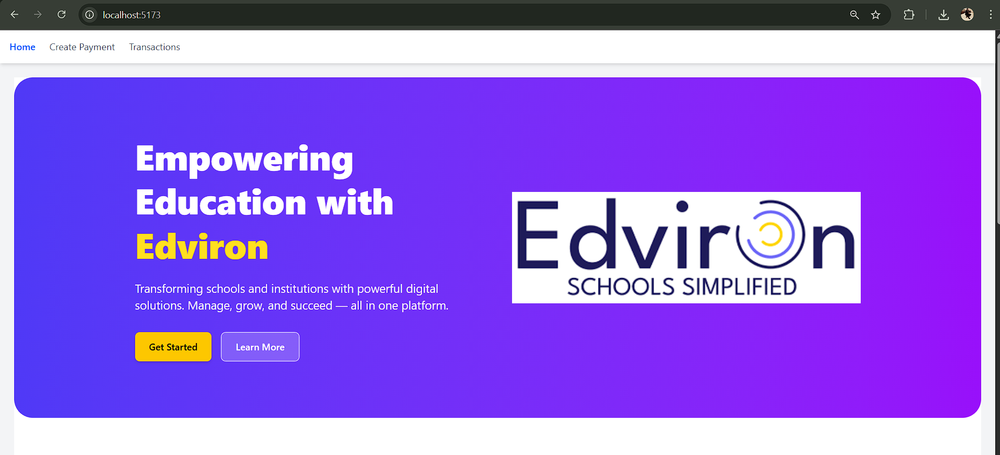
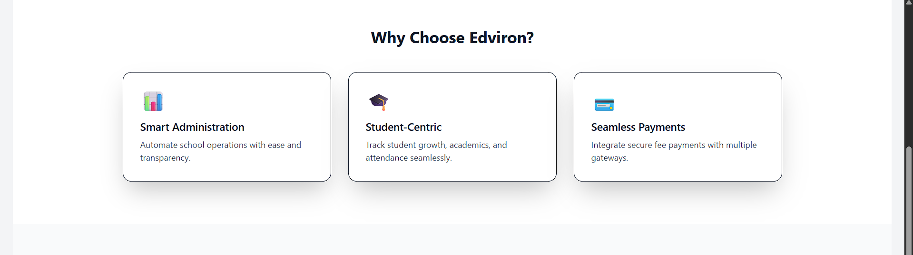
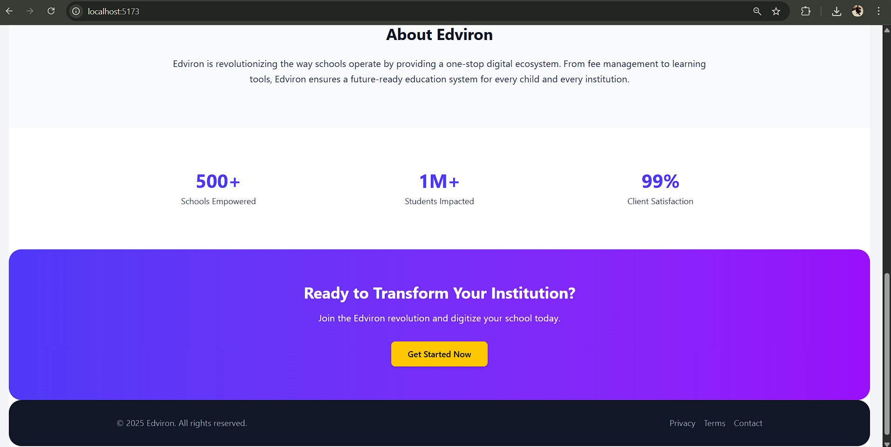
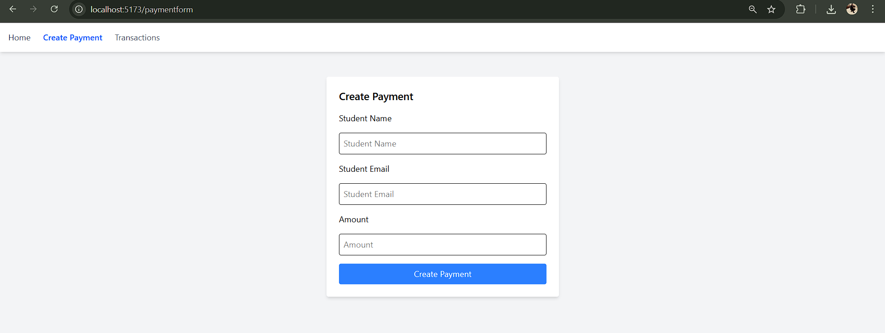
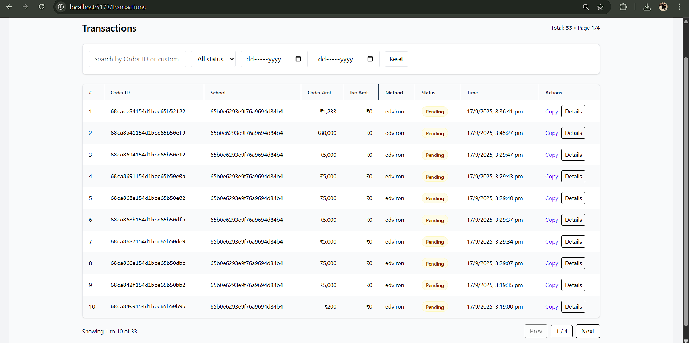
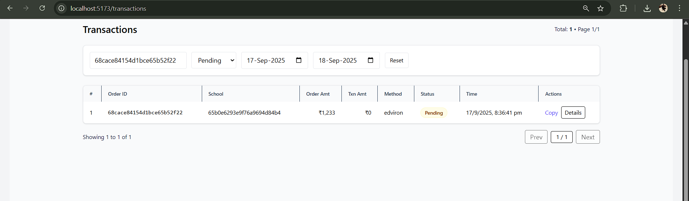
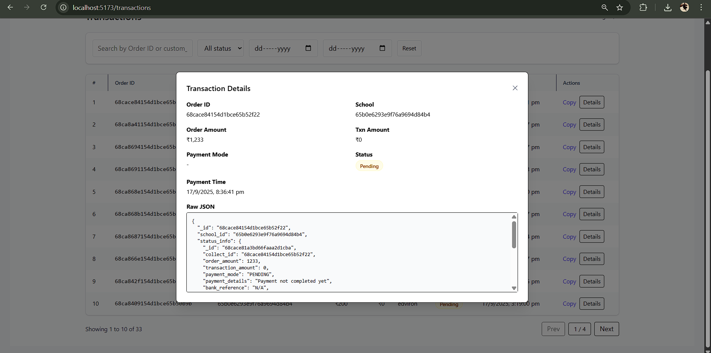

# Edviron Frontend (React + Vite)

This is the **frontend** of the Edviron project, a modern educational payment and transaction management platform. It is built with **ReactJS** and **Vite** for fast development with Hot Module Replacement (HMR) and ESLint integration.  

---

## Table of Contents

- [Project Overview](#project-overview)  
- [Screenshots](#screenshots)  
- [Installation](#installation)  
- [Usage](#usage)  
- [Folder Structure](#folder-structure)  
- [React + Vite](#react--vite)  
- [Technologies Used](#technologies-used)  
- [Contributing](#contributing)  
- [License](#license)  

---

## Project Overview

Edviron Frontend provides a responsive interface for managing educational payments, viewing transaction details, and generating reports. It includes features like:

- Dashboard with transaction overview  
- Payment form integration  
- Filtering and pagination for transactions  
- Detailed transaction views  

---

## Screenshots

### Home Page
  
  
  

### Payments
  

### Transactions
  
  
  
 

---

## Installation

1. Clone the repository:

```bash
git clone https://github.com/yourusername/edviron-frontend.git

- Change Directory

cd edviron-frontend

- install all node modules 
npm install

- To start
npm run dev


